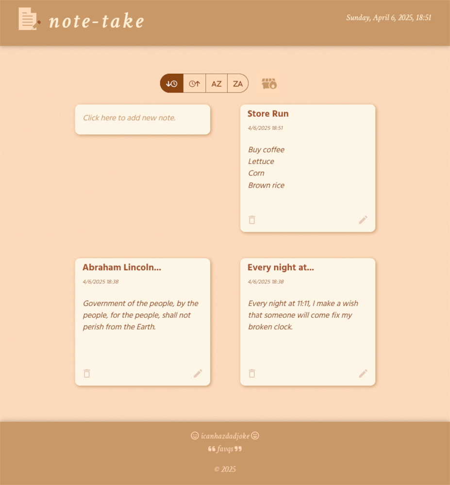
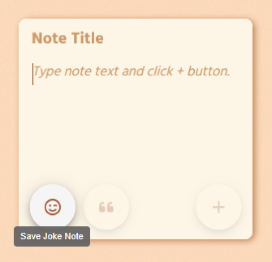
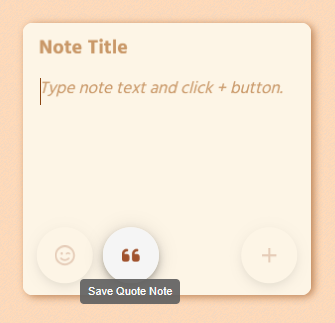
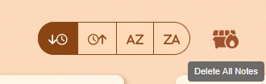
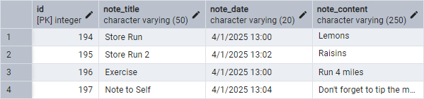

# **_note-take_**

Version: 1.0.0

My second Node.js/React project, created as capstone project for Angela Yu's [The Complete Full-Stack Web Development Bootcamp](https://www.udemy.com/course/the-complete-web-development-bootcamp/) on Udemy.

A web app which allows users to add notes and incorporates PostgreSQL database functionality asserted locally via _pgAdmin 4_.

In addition to typing a new note/title, the user may click one of the _Material UI_ buttons to save a 'joke' or 'quote' note, which will query external APIs.

I made good use of Google, StackOverflow and ChatGPT for looking stuff up and troubleshooting. ChatGPT was especially helpful in providing guidance when I was stuck, and assisting with commenting.

Notes, details, comments, docstrings coming soon...

_If you have any corrections/suggestions, please let me know!_

### **_Main Resources:_**

-   [**_Visual Studio Code_**](https://code.visualstudio.com/)

-   [**_Node.js_**](https://nodejs.org)

-   [**_NVM_**](https://github.com/nvm-sh/nvm)

-   [**_React_**](https://react.dev/)

-   [**_Material UI_**](https://mui.com/material-ui/)

-   [**_Font Awesome_**](https://fontawesome.com/)

-   [**_Bootstrap_**](https://getbootstrap.com/)

-   [**_Google Fonts_**](https://fonts.google.com/)

-   [**_GIMP_**](https://www.gimp.org/)

-   [**_pgAdmin 4_**](https://www.pgadmin.org/)

-   [**_icanhazdadjoke API_**](https://icanhazdadjoke.com/api)

-   [**_favqs API_**](https://favqs.com/api)

-   [**_mdn_**](https://developer.mozilla.org/en-US/docs/Web/JavaScript)

-   [**_Stack Overflow_**](https://stackoverflow.com/)

-   [**_ChatGPT_**](https://chatgpt.com/)

### **_Screenshots:_**

#### **_Desktop (Firefox, Restore Down):_**



#### **_Responsive Display for Mobile Browser:_**


#### **_Add a 'Joke' Note:_**



#### **_Add a Quotation:_**



#### **_Delete All Notes Button:_**



#### **_Sort Four Ways:_**


### **_Project Structure:_**

Project is organized by standard React/Node.js standards,. helping to keeps things clear and compartmentalized.

If you see any issues please let me know!

<font size=1>

```terminal
note-take
  | - .env
  | - .gitignore
  | - client
  |  | - index.html
  |  | - public
  |  |  | - pencil_120.png
  |  |  | - pencil_32.ico
  |  | - src
  |  |  | - App.css
  |  |  | - App.jsx
  |  |  | - assets
  |  |  |  | - react.svg
  |  |  | - components
  |  |  |  | - AllNotes.jsx
  |  |  |  | - Footer.jsx
  |  |  |  | - formatDate.js
  |  |  |  | - Header.jsx
  |  |  |  | - Joke.jsx
  |  |  |  | - NewNote.jsx
  |  |  |  | - OneNote.jsx
  |  |  |  | - RadioSortButton.jsx
  |  |  |  | - RadioSortButtons.jsx
  |  |  | - data
  |  |  |  | - exampleNotes.js
  |  |  | - main.jsx
  | - devNotes.ipynb
  | - eslint.config.js
  | - LICENSE
  | - package-lock.json
  | - package.json
  | - README.md
  | - server
  |  | - index.js
  |  | - utils
  |  |  | - formatDate.js
  | - struct.md
  | - vite.config.js

```

</font>

### **_Installation/Getting Started:_**

Install Node.js, connecting functionality with _VS Code_.

<font size=2>

#### **_Update `npm` and Node.js Versions Globally:_**

-   **Check Node.js and `npm` versions**:

    ```bash
    npm list -g
    npm list
    ```

-   **Update `npm` and Node.js**:

    ```bash
    npm install -g npm@latest
    nvm install latest
    nvm use <version_number>
    ```

#### **_Install/Update `npm` Locally:_**

-   **Install dependencies from `package.json`**:

    ```bash
    npm install npm@latest
    ```

-   **Or install dependencies manually:**:

    ```bash
    npm i react
    npm install @mui/icons-material @mui/material @emotion/styled @emotion/react
    # etc...
    ```

-   **Update dependencies within their version ranges**:

    ```bash
    npm update
    ```

-   **Upgrade all dependencies to the latest major versions**:

    ```bash
    npx npm-check-updates -u
    npm install
    ```

<font>

Initialize the React project:

<font size=2>

```bash
# Initialize React project using Vite:
npm create vite@latest note-take --template react.
cd node-take
npm install
```

</font>

Configure `vite.config.js` to allow ease of running the app and the server:

<font size=2>

```js
import { defineConfig } from "vite";
import react from "@vitejs/plugin-react";

export default defineConfig({
    root: "client", // Ensures Vite runs from /client
    plugins: [react()],
    server: {
        port: 5173,
    },
});
```

</font>

Run the server and the React client in two separate terminals via:

<font size=2>

```bash
# Terminal 1:
cd .../note-take
npm run dev

# Terminal 2:
cd .../note-take
npm run server
```

</font>

### **_Database Creation Steps:_**

Install **pgAdmin 4**, which will allow PostgreSQL functionality in my local environment.

Here's the process I used:

#### **_Create the Database:_**

Manually create a database in the _pgAdmin 4_ GUI by right-clicking on `Databases`, then `Create > Database`.

I named it `note_take`.

The rest of the steps via the `Query Tool`...

#### **_Create the Table:_**

<font size=1>

```sql
CREATE TABLE note_take (
    id SERIAL PRIMARY KEY,
    note_name VARCHAR(50),
    note_date VARCHAR(20),
    note_content VARCHAR(250),
);
```

</font>

Optionally use `not null` to require a field:

<font size=1>

```sql
CREATE TABLE note_take (
    id SERIAL PRIMARY KEY,
    note_name VARCHAR(50),
    note_date VARCHAR(20) NOT NULL,
    note_content VARCHAR(250),
);
```

</font>

#### **_Rename Table:_**

I accidentally used the database name `note_take` for the table as well.

Better practice to have use a different table name:

<font size=1>

```sql
ALTER TABLE note_take RENAME TO notes;
```

</font>

#### **_Rename a Column:_**

I preferred a different name instead of `note_name`:

<font size=1>

```sql
ALTER TABLE
RENAME note_name to note_title;
```

</font>

#### **_Manually Add a Row:_**

<font size=1>

```sql
INSERT INTO notes (note_title, note_date, note_content)
VALUES (
    'Store Run',
    '4/1/2025 13:00',
    'Lemons
Apples');
```

</font>

#### **_Manually Add Multiple Rows:_**

<font size=1>

```sql
INSERT INTO notes (note_title, note_date, note_content)
VALUES (
    'Store Run 2',
    '4/1/2025 13:02',
    'Raisins
Brown Rice'),
(
    'Exercise',
    '4/1/2025 13:00',
    'Run 4 miles'),
(
    'Note to Self',
    '4/1/2025 13:04',
    'Don''t forget to tip the mailman.');
```

</font>

#### **_The Table in pgAdmin 4 Now Looks Like:_**



### **_General Project Notes:_**

Lots of time spend gaining intuition on how _props_ are passed between module, which direction they go and how they're called.

I used custom names for each component's props, as it's easier for me to track what's happending, _e.g_, instead of `function AllNotes(props)` I used `function AllNotes(allNotesProps)`. This might seem redundant, but it's really helpful to me in conceptually mapping the process.

I learned the difference between naming environment variables in the client end vs the server end:

```python
# Client end uses plain names:
DB_USER="*****"
DB_HOST="*****"
DB_NAME="*****"
FAVQS_TOKEN="*****"
# etc...
```

```python
# Server end uses the `VITE_` prefix:
VITE_SERVER_HOST="*****"
VITE_SERVER_PORT="*****"
# etc...
```

My comments/docstrings are still rather incomplete/sparse. It's easier for me to write the code without too much clutter, especially as I'm learning new syntax/functionality. So I plan to add a lot more inline documentation soon. And I should probably get more comfortable adding comments as I write the code, even though it makes things a bit too dense for me to read as I'm learning, as it will be helpful for future reference...

Lots of care went into the CSS styling, I tried to give a warm and natural feel to the interface, with subtle animations that are pleasing to the eye.

I put most of the styling in the single `App.css` file.

More care still needs to be made to further compartmentalize some of the functionality into separate components. There's a bit too much spaghetti code, but overall I'm satisfied with this project, it's a milestone in my education!

Please let me know if you have any comments, corrections or recommendations.

### **_Pain Points:_**

The goal was create a simple, one-page webapp which allows the user to input/write notes, edit them, delete them, and more...

This involved creating a frontend and backend, so the notes persist in a database.

Here's some interesting/challenging concepts that I encountered:

-   Espcially challenging was learning to use `useState` and `useEffect`. It's taking a lot of reps to build intuition.

-   Also difficult to learn is the concept of `props` parameters, where they're first indicated and how to follow them up and down the chain of functionality. Lots and lots of practice required!

-   Okay to use `.js` instead of `.jsx` extension. This is a subject of debate in the developer community.

-   Components like `App()` are called a 'functional components'.

-   HTML elements must always be lower case, custom components always PascalCase, so React can differentiate when you're trying to use custom React component vs. tapping into native HTML elements.

-   Be careful what path is indicated to the CSS file both in the JSX imports and in the HTML file. It can be tricky, depending on the setup of the environment.

-   You cannot add a class name directly to a custom component: ~~`<Note className="note">`~~. HTML attributes need to be applied to HTML elements.

---

<font size=2>

_Andrew Blais, Boston, Massachusetts_

GitHub: https://github.com/andrewblais

Website/Python Web Development Porfolio: https://www.andrewblais.dev/

</font>
