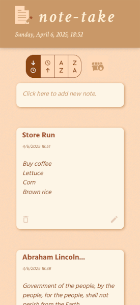

# **_note-take_**

<hr style="height: 0; box-shadow: 0 0 5px 4px crimson; width: 95%; margin: 2rem auto;">

My second Node.js/React project, created as capstone project for Angela Yu's [The Complete Full-Stack Web Development Bootcamp](https://www.udemy.com/course/the-complete-web-development-bootcamp/) on Udemy.

A web app which allows users to add notes and incorporates PostgreSQL database functionality asserted locally via [**_pgAdmin 4_**](https://www.pgadmin.org/).

In addition to typing a new note/title, the user may click one of the [Material UI](https://mui.com/material-ui/) buttons to save a 'joke' or 'quote' note, which will query external APIs: https://icanhazdadjoke.com/api and https://favqs.com/api.

Notes, details, comments, docstrings coming soon...

_If you have any corrections/suggestions, please let me know!_

<hr style="height: 0; box-shadow: 0 0 5px 4px crimson; width: 95%; margin: 2rem auto;">

## **_Screenshots:_**

#### **_Desktop (Firefox):_**


#### **_Responsive Display for Mobile Browser:_**



#### **_Add a 'Joke' Note:_**


#### **_Add a Quotation:_**


#### **_Delete All Notes Button:_**


#### **_Sort Four Ways:_**


<hr style="height: 0; box-shadow: 0 0 5px 4px crimson; width: 95%; margin: 2rem auto;">

## **_Project Structure:_**

<font size=1>

```terminal
note-take
  | - .env
  | - .gitignore
  | - client
  |  | - index.html
  |  | - public
  |  |  | - pencil_120.png
  |  |  | - pencil_32.ico
  |  | - src
  |  |  | - App.css
  |  |  | - App.jsx
  |  |  | - assets
  |  |  |  | - react.svg
  |  |  | - components
  |  |  |  | - AllNotes.jsx
  |  |  |  | - Footer.jsx
  |  |  |  | - formatDate.js
  |  |  |  | - Header.jsx
  |  |  |  | - Joke.jsx
  |  |  |  | - NewNote.jsx
  |  |  |  | - OneNote.jsx
  |  |  |  | - RadioSortButton.jsx
  |  |  |  | - RadioSortButtons.jsx
  |  |  | - data
  |  |  |  | - exampleNotes.js
  |  |  | - main.jsx
  | - devNotes.ipynb
  | - eslint.config.js
  | - LICENSE
  | - package-lock.json
  | - package.json
  | - README.md
  | - server
  |  | - index.js
  |  | - utils
  |  |  | - formatDate.js
  | - struct.md
  | - vite.config.js

```

</font>

<hr style="height: 0; box-shadow: 0 0 5px 4px crimson; width: 95%; margin: 2rem auto;">

## **_Installation/Getting Started:_**

Install Node.js, connecting functionality with [**_VS Code_**](https://code.visualstudio.com/).
Ensure everything is up to date:

<font size=2>

#### **Update `npm` and Node.js Versions Globally**

-   **Check Installation**:

    ```bash
    npm list -g
    npm list
    ```

-   **Update `npm` (global)**:

    ```bash
    npm install -g npm@latest
    ```

-   **Install and use the latest Node.js version**:

    ```bash
    nvm install latest
    nvm use <version_number>
    ```

#### **Install/Update `npm` Locally**

-   **Install dependencies from `package.json`**:

    ```bash
    npm install npm@latest
    ```

-   **Or install dependencies manually:**:

    ```bash
    npm i react
    npm install @mui/icons-material @mui/material @emotion/styled @emotion/react
    # etc...
    ```

-   **Update dependencies within their version ranges**:

    ```bash
    npm update
    ```

-   **Upgrade all dependencies to the latest major versions**:

    ```bash
    npx npm-check-updates -u
    npm install
    ```

<font>
<hr style="height: 0; box-shadow: 0 0 5px 4px dodgerblue; width: 85%; margin: 2rem auto;">
Initialize the React project:

<font size=2>

```bash
npm create vite@latest note-take --template react.
cd node-take
npm install
```

</font>
<hr style="height: 0; box-shadow: 0 0 5px 4px dodgerblue; width: 85%; margin: 2rem auto;">
Configure `vite.config.js` to allow ease of running the app and the server:

<font size=2>

```js
import { defineConfig } from "vite";
import react from "@vitejs/plugin-react";

export default defineConfig({
    root: "client", // Ensures Vite runs from /client
    plugins: [react()],
    server: {
        port: 5173,
    },
});
```

</font>
<hr style="height: 0; box-shadow: 0 0 5px 4px dodgerblue; width: 85%; margin: 2rem auto;">
Run the server and the React client in two separate terminals via:

<font size=2>

```bash
# Terminal 1:
cd .../note-take
npm run dev

# Terminal 2:
cd .../note-take
npm run server
```

</font>

<hr style="height: 0; box-shadow: 0 0 5px 4px crimson; width: 95%; margin: 2rem auto;">

## **_Database Creation Steps:_**

Install **pgAdmin 4**, which will allow PostgreSQL functionality in my local environment.

More notes to come...

<hr style="height: 0; box-shadow: 0 0 5px 4px crimson; width: 95%; margin: 2rem auto;">

## **_Notes on Modules:_**

Coming soon...

<hr style="height: 0; box-shadow: 0 0 5px 4px crimson; width: 95%; margin: 2rem auto;">

## **_Pain Points:_**

Details to follow...

<hr style="height: 0; box-shadow: 0 0 5px 4px crimson; width: 95%; margin: 2rem auto;">

<font size=2>

_Andrew Blais, Boston, Massachusetts_

GitHub: https://github.com/andrewblais

Website/Python Web Development Porfolio: https://www.andrewblais.dev/

</font>
