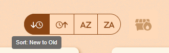

# 📝 note-take


**note-take** is a full-stack, single-page note-taking app built with React, Node.js, and PostgreSQL. Users can write their own notes or auto-generate jokes and quotes from public APIs. Data is persisted locally via PostgreSQL and managed through `pgAdmin 4`.

This app was built as the capstone project for Angela Yu’s [Complete Full-Stack Web Development Bootcamp](https://www.udemy.com/course/the-complete-web-development-bootcamp/) on Udemy.

---

## 📚 Table of Contents

-   [Screenshots](#-screenshots)
-   [Installation](#-installationgetting-started)
-   [Database Setup](#-database-setup)
-   [Project Structure](#-project-structure)
-   [Reflections & Lessons](#-reflections--pain-points)
-   [Resources](#-resources)
-   [Author](#-andrew-blais)

---

## 🖼 Screenshots

#### 🖥 Desktop View (Firefox)


#### 📱 Mobile Display


#### 🎭 Add a Joke


#### 💬 Add a Quote


#### 🗑 Delete All Notes


#### ↕️ Sort Four Ways



---

## 🚀 Installation/Getting Started

> ⚠️ This app is currently configured for local development. Cloud deployment (via AWS EC2 + S3) is underway.

### Prerequisites

-   [Node.js](https://nodejs.org)
-   [VS Code](https://code.visualstudio.com)
-   [pgAdmin 4](https://www.pgadmin.org/)
-   [nvm](https://github.com/nvm-sh/nvm) (optional)

### 1. Setup Node and npm

```bash
npm install -g npm@latest
nvm install --lts
nvm use <version_number>
```

### 2. Install Dependencies

```bash
npm install
```

Or manually:

```bash
npm i react
npm i @mui/icons-material @mui/material @emotion/styled @emotion/react
```

### 3. Update All Dependencies (Optional)

```bash
npm update
npx npm-check-updates -u
npm install
```

### 4. Initialize Frontend (Vite)

```bash
npm create vite@latest note-take --template react
cd note-take
npm install
```

### 5. Run React and Node Servers

In separate terminals:

```bash
# Terminal 1:
npm run dev

# Terminal 2:
npm run server
```

---

## 🛢 Database Setup

Using pgAdmin 4 for local PostgreSQL management:

### Create Database

-   In `pgAdmin 4`, right-click on **Databases → Create → Database**
-   Name it: `note_take`

### Create Table

```sql
CREATE TABLE note_take (
    id SERIAL PRIMARY KEY,
    note_name VARCHAR(50),
    note_date VARCHAR(20),
    note_content VARCHAR(250)
);
```

### Rename Table

```sql
ALTER TABLE note_take RENAME TO notes;
```

### Rename a Column

```sql
ALTER TABLE notes RENAME note_name TO note_title;
```

### Insert Sample Rows

```sql
INSERT INTO notes (note_title, note_date, note_content)
VALUES
('Grocery List', '4/1/2025 13:00', 'Lemons\nApples'),
('Workout', '4/1/2025 13:02', 'Run 4 miles'),
('Note to Self', '4/1/2025 13:04', 'Don''t forget to tip the mailman.');
```

#### 📸 Table Preview


---

## 🗂 Project Structure

```
note-take
├── .env
├── .gitignore
├── client/
│   ├── index.html
│   ├── public/
│   │   ├── pencil_120.png
│   │   └── pencil_32.ico
│   └── src/
│       ├── App.css
│       ├── App.jsx
│       ├── assets/
│       ├── components/
│       │   ├── AllNotes.jsx
│       │   ├── Footer.jsx
│       │   ├── formatDate.js
│       │   ├── Header.jsx
│       │   ├── Joke.jsx
│       │   ├── NewNote.jsx
│       │   ├── OneNote.jsx
│       │   ├── RadioSortButton.jsx
│       │   └── RadioSortButtons.jsx
│       ├── data/
│       │   └── exampleNotes.js
│       └── main.jsx
├── devNotes.ipynb
├── eslint.config.js
├── LICENSE
├── package.json
├── server/
│   ├── index.js
│   └── utils/
│       └── formatDate.js
├── struct.md
└── vite.config.js
```

---

## 🧠 Reflections & Pain Points

### Things I Learned

-   `useState` and `useEffect` were initially confusing, but they’re starting to click with practice.
-   Passing `props` and tracing them across component hierarchies took a lot of repetition to understand.
-   I customized prop names like `function AllNotes(allNotesProps)` for clarity.
-   Differentiating `.js` and `.jsx` is more about preference and tooling than strict rules.
-   React requires lowercase HTML elements but PascalCase custom components.
-   CSS import paths can be tricky in Vite; trial-and-error helped a lot.
-   HTML attributes like `className` don’t pass to custom components — must be forwarded internally.

### Developer Notes

-   I focused on giving the app a warm, friendly feel using subtle transitions and natural styling in `App.css`.
-   I kept comments minimal during active coding to stay mentally clear — but plan to add thorough docstrings and inline docs soon.

---

## 📦 Resources

-   [Node.js](https://nodejs.org)
-   [React](https://react.dev/)
-   [Material UI](https://mui.com/)
-   [Font Awesome](https://fontawesome.com/)
-   [Bootstrap](https://getbootstrap.com/)
-   [Google Fonts](https://fonts.google.com/)
-   [GIMP](https://www.gimp.org/)
-   [pgAdmin 4](https://www.pgadmin.org/)
-   [icanhazdadjoke API](https://icanhazdadjoke.com/api)
-   [favqs API](https://favqs.com/api)
-   [MDN Web Docs](https://developer.mozilla.org/en-US/)
-   [Stack Overflow](https://stackoverflow.com/)
-   [ChatGPT](https://chat.openai.com)

---

_If you spot anything broken or unclear, feel free to open an issue or PR. Thanks for visiting!_

---

_Andrew Blais, Boston, Massachusetts_

📖 Student of full-stack web development, machine learning, and software engineering

🏠 Boston, Massachusetts

🔗 [GitHub](https://github.com/andrewblais) | [Portfolio](https://andrewblais.dev)
